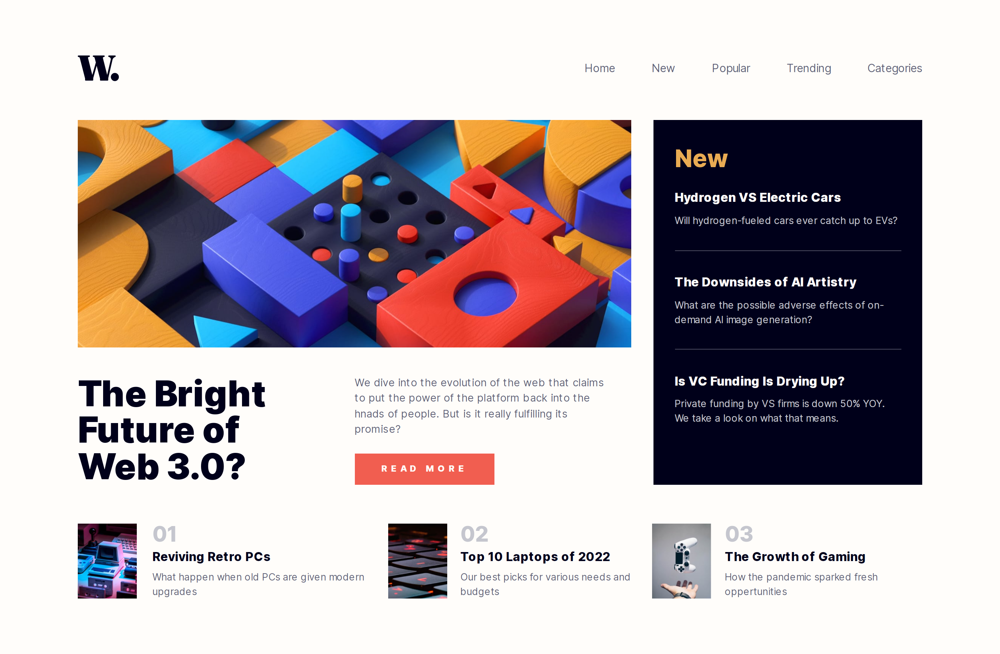

# Frontend Mentor - News homepage solution

This is a solution to the [News homepage challenge on Frontend Mentor](https://www.frontendmentor.io/challenges/news-homepage-H6SWTa1MFl). Frontend Mentor challenges help you improve your coding skills by building realistic projects. 

## Table of contents

- [Overview](#overview)
  - [The challenge](#the-challenge)
  - [Screenshot](#screenshot)
  - [Links](#links)
- [My process](#my-process)
  - [Built with](#built-with)
  - [What I learned](#what-i-learned)
  - [Continued development](#continued-development)
- [Author](#author)
## Overview

### The challenge

Users should be able to:

- View the optimal layout for the interface depending on their device's screen size
- See hover and focus states for all interactive elements on the page

### Screenshot

### Links

- Solution URL: [Here](https://your-solution-url.com)
- Live Site URL: [Here](https://irbaine.github.io/news-homepage-fem/)

## My process

### Built with

- [React](https://reactjs.org/) - JS library
- [Next.js](https://nextjs.org/) - React framework
- [TailWind CSS](https://tailwindcss.com/) - For styles

### What I learned

This challenge is good as a start, it is not very complex, even though it helped me to get more comfortable with Tailwind CSS and Flexboxes.

### Continued development

After this challenge I am excited to delve into more complex challenges to improve my skills and my productivity to produce more apps faster, and get more comfortable with TailwindCSS without checking the documentations everytime.
Also, getting more comfortable with forms is my next goal, that's why I am planning to start with a new [Frontend Mentor](https://www.frontendmentor.io) challenge that requires form submission.

## Author

- Website - [Irbaine](https://www.irbaine.com)
- Frontend Mentor - [@Irbaine](https://www.frontendmentor.io/profile/irbaine)
- Twitter - [@Amineirb](https://twitter.com/amineirb)

